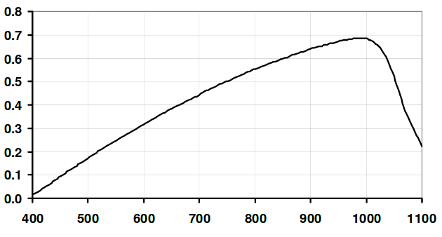

# Graph2Data
This code was written as a means to convert images of plots to obtain accurate data. Through our assignments for the IUCAA-NCRA graduate school 2018-19, we had to sift through many plots in papers/screenshots, and figure out the values in the plots. An example of such a plot is shown below:

The above picture is the response of a photodiode, which we were supposed to use for obtaining irradiance spectrum of scintillations. To obtain the responsivity values for a given wavelength, different people used different techniques:
1. I tried to look at automatic extraction of values, and see if some Computer Vision could be used. However, due to lack of time, I just used the standard engineering way - judge approximately what the values are, by eye!
2. My friend Parisee Shirke, also a graduate student at IUCAA, however had a more accurate method. She looked for a mapping between the pixel values and actual graph values, and after defining the two axes, inverted this mapping to obtain the values at a given pixel location. I found this method pretty cool, and decided to write it up as a code, and see if it can be used in future.

The code basically needs at least 2 points on the y and x axis, to generate a scaling along the two axes, and also the bias values for computing the coordinates. A small demo is shown below, and a clearer version can be found [here](Example/Example.mp4):

The code was written by myself, and the validation tests, audit done by Parisee. 

---------------------------------------
### Requirements
1. matplotlib >= 2.2.2
2. numpy >= 1.14.2
---------------------------------------
### Tests
We have checked the code for (i). Photodiode response curve, and (ii). Spectrum of a quasar. The quasar spectrum as been shown below:
 

The lines identified are as below:
Wavelength from code ($\AA$) | Actual wavelength ($\AA$)
---------------------------- | --------------------------
4750.40 | 4746.38 
4827.14 | 4821.68
5416.80 | 5420.2
5889.34 | 5886.9
